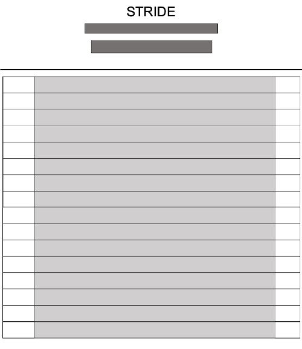

Stride is a day planner that allows a user to save tasks for each hour. Click here to access the planner.

### Feature
____
- Current day and time display
- Color coded time-blocks (past, present and future)
- Memorised events for the day
- Self-refresh start for each day

### Wireframe
____
Inital wireframe for the project:  

